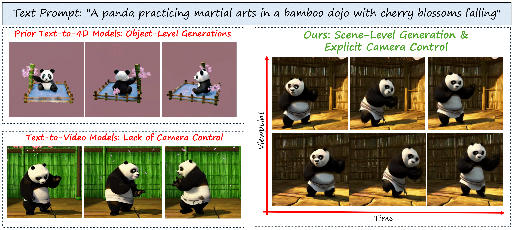

# PaintScene4D: Consistent 4D Scene Generation from Text Prompts
[Vinayak Gupta](https://vinayak-vg.github.io/)<sup>1</sup>,
[Yunze Man](https://yunzeman.github.io/)<sup>2</sup>,
[Yu-Xiong Wang](https://yxw.cs.illinois.edu/)<sup>2</sup>

<sup>1 </sup>Indian Institute of Technology Madras, <sup>2 </sup>University of Illinois Urbana-Champaign

[[`Project Page`](https://paintscene4d.github.io/)] [[`arXiv`](https://arxiv.org/abs/2412.04471)]

[](https://arxiv.org/abs/2412.04471)
[](https://paintscene4d.github.io/) 
[](https://opensource.org/licenses/MIT)

## Overview

🎲 **PaintScene4D** generates photorealistic 4D scenes from text prompts which are both spatially and temporally consistent. 

🚀 **PaintScene4D** generates 4D scenes in around 3hrs compared to SDS-based object level rendering methods that take around 12hrs to train and render. 

🛠️ **PaintScene4D** unlocks new capabilities for camera trajectory control, an edge over traditional text-to-video model which don't have any spatial understanding. 



## News

- [12/06/2024] 📋 Paper is currently under review. Code will be released upon acceptance.

- [12/06/2024] 🎉 The paper appears on Arxiv.

## Citation

If you find this work useful in your research, please consider citing:

```bibtex
@article{gupta2024paintscene4d,
      title={PaintScene4D: Consistent 4D Scene Generation from Text Prompts}, 
      author={Vinayak Gupta and Yunze Man and Yu-Xiong Wang},
      journal={https://arxiv.org/abs/2412.04471}, 
      year={2024},
}
```
<!-- 

## Acknowledgement

Thank you to the open-source community for their explorations on autoregressive generation, especially [LLaMAGen](https://github.com/FoundationVision/LlamaGen). -->